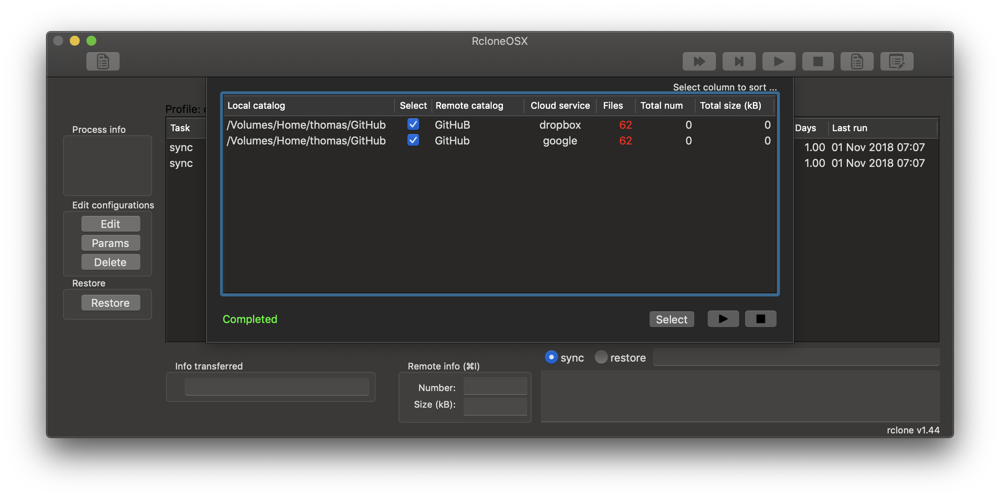

## RcloneOSX

The project is a adapting [RsyncOSX](https://github.com/rsyncOSX/RsyncOSX) utilizing [rclone](https://rclone.org/) for synchronizing and backup of catalogs and files to a number of cloud services. RcloneOSX utilizes `rclone copy`, `sync`, `move` and `check` commands.

RcloneOSX is compiled with support for macOS El Capitan version 10.11 - macOS Mojave version 10.14. The application is implemented in Swift 4 by using Xcode 10. RcloneOSX require the `rclone` command line utility to be installed. If installed in other directory than `/usr/local/bin`, please change directory by user Configuration in RcloneOSX. RcloneOSX checks if there is a rclone installed in the provided directory.

Rclone is *rsync for cloud storage*. Even if `rclone` and `rsync` are somewhat equal they are also in many ways different. RcloneOSX is built upon the ideas from RsyncOSX. But it is not easy to clone all functions in RsyncOSX to RcloneOSX. I spend most of my time developing RsyncOSX. From time to time some of the functions are ported to RcloneOSX from RsyncOSX.

I am not an advanced user of `rclone`. My main use of RcloneOSX is  synchronizing my GitHub catalog to Dropbox and Google. I have also implemented [encrypted](https://rsyncosx.github.io/Encrypted) backup in RsyncOSX by utilizing RcloneOSX. During this winter (2018/2019) the functions within RcloneOSX will be enhanced. But I need to learn more about rclone before enhancing RcloneOSX.

To get an idea of how RcloneOSX is working please see the [intro](https://rsyncosx.github.io/Intro) to RsyncOSX. The operation and menus are mostly equal.

The main view of RcloneOSX.

Automatic synchronizing in action.

### Application icon

The application icon is created by [Zsolt Sándor](https://github.com/graphis). All rights reserved to Zsolt Sándor.

### Changelog

Please see [Changelog](https://rsyncosx.github.io/RcloneChangelog)

### Compile

To compile the code, install Xcode and open the RcloneOSX project file. Before compiling, open in Xcode the `RcloneOSX/General` preference page (after opening the RcloneOSX project file) and replace your own credentials in `Signing`, or disable Signing.

There are two ways to compile, either utilize `make` or compile by Xcode. `make release` will compile the `rcloneosx.app` and `make dmg` will make a dmg file to be released.  The build of dmg files are by utilizing [andreyvit](https://github.com/andreyvit/create-dmg) script for creating dmg and [syncthing-macos](https://github.com/syncthing/syncthing-macos) setup.
